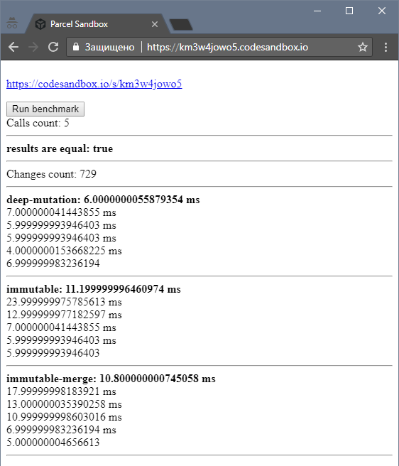
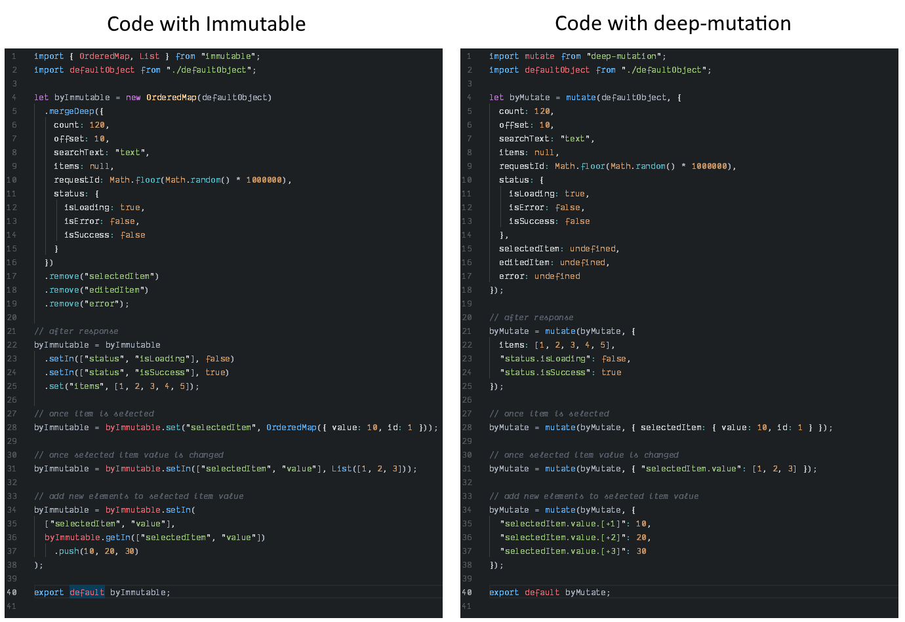

# deep-mutation

1. [What is it?](#what-is-it)
2. [Installation](#installation)
3. [What does it do?](#installation)
    * [Simple example](#simple-example)
    * [Array specific keys](#array-specific-keys)
    * [mutate.deep(..) or deepPatch(...)](#mutatedeep-or-deeppatch)
    * [Deep-mutation can return updater-function](#deep-mutation-can-return-updater-function)
4. [Immutable comparison](#immutable-comparison)
5. [Tests cases / code example](#tests-cases--code-example)
6. [Use cases for 'deep-mutation'](#use-cases-for-deep-mutation)
7. [Live TODO Example in Codesandbox](https://codesandbox.io/s/deep-mutation-todo-1w022)
8. [Examples](./EXAMPLES.md)

## What is it?

It is a simple function which gets an object and a list of changes and returns a new updated object.

**Since the version 2.0.0 `deep-mutation` returns a new object only when something was changed**

## Installation

```
npm install --save deep-mutation
```

## What does it do?

### Getting a new object with changes
#### with plain JavaScript
```javascript
const obj = { a: 10, b: 20, c: { c1: 1, c2: 2, c3: { c31: 31 } }};
const result = {
  ...obj,
  c: {
    ...obj.c,
    c3: {
      ...obj.c3,
      c32: 25
    }
  }
};
```

#### doing the same with `deep-mutation`

```javascript
import mutate from 'deep-mutation';
const resultMutate = mutate(obj, { 'c.c3.c32': 25 });
// OR
const resultMutate = mutate(obj, [['c.c3.c32', 25]]);
// OR since v2.1.0
const resultMutate = mutate(obj, [[['c', 'c3', 'c32'], 25]]);
// OR since v3.0.0
const resultMutate = mutate.deep(obj, { c: { c3: { c32: 25 } } });
```

### Simple example
```javascript
import mutate from 'deep-mutation';

const myObject = {
  a: 100,
  b: 200,
  c: {
    c1: 1,
    c2: 2
  },
  d: []
};

const changes = [
  ['a', 111],
  ['b.b1', 222],
  ['b.b2', 'text'],
  ['c.c1', 20],
  ['c.c2'],
  ['d.[]', 10],
  ['d.[]', 20],
  ['e', [1,2,3]]
];

const result = mutate(myObject, changes);
```

#### 'result' will be
```javascript
{
  a: 111,
  b: {
    b1: 222,
    b2: 'text'
  },
  c: {
    c1: 20
  },
  d: [10,20],
  e: [1,2,3]
}
```

### Changes can be specified as an array of arrays or an object where each key is a path or object converted by `deepPatch` function:

```javascript
// array of arrays
const changes = [
  ['a', 111],
  ['b.b1', 222],
  ['b.b2', 'text'],
  ['c.c1', 20],
  ['c.c2'],
  ['d.[]', 10],
  ['d.[]', 20],
  ['e', [1,2,3]]
];
```

**OR**

```javascript
// object
const changes = {
  a: 111,
  'b.b1': 222,
  'b.b2': 'text',
  'c.c1': 20,
  'c.c2': undefined,
  'd.[+123412]': 10,
  'd.[+544555]': 20,
  e: [1,2,3]
};
```

**OR**

```javascript
// deep patch
import { deepPatch } from 'deep-mutation';

const changes = deepPatch({
  a: 111,
  b: { b1: 222, b2: 'text' },
  c: { c1: 20, c2: undefined },
  d: { '[+123412]': 10, '[+544555]': 20 },
  e: [1,2,3]
});
```

## Array specific keys

### :> a.[] or a.[+242234]
If a key for an array item starts from `+`, then the **value will be appended to the end of the array** like `[].push()`.
```javascript
...
  'arr.[+123312312]': 100
// OR
  'arr.[+6]': 100
// will be equal to
  'arr.[]': 100
...
```
It is usefult when you need to add some items to an array and use changes as an Object.
```javascript
import muatate from 'deep-mutation';
...
return mutate({ arr: [] }, {
  // It is an error because JS object can't have values with the same keys!
  // 'arr.[]': 1,
  // 'arr.[]': 2,

  //It is the correct way
  'arr.[+1123]': 1,
  'arr.[+232]': 2,
  'arr.[+43534]': 3,
  'arr.[+64]': 4,
  'arr.[]': 5,
});

// the result will be = { arr: [1,2,3,4,5] }
```
### :> arr.[=10] or arr.[=id=15]

If a key for an array item starts from `=` ([=10] or [=data.id=99]), then index will be found by comparison item or item's property and value. `[=field.path=value]`.
```javascript
import muatate from 'deep-mutation';
...
return mutate({ arr: [1,2,3,4,5,6,7,8] }, {
  'arr.[=2]': 200,
  // index for element with value `2` will be `1`
  'arr.[=8]': 800,
  // index for element with value `8` will be `7`
  'arr.[=100]': 'undefined',
  // `100` is not found in arr and will be ignored, index is `-1`
});

// the result will be = { arr: [1,200,3,4,5,6,7,800] }
```
`arr.[=]` or `arr.[=value=]` - to find empty string value in array (or item.value = '')
`arr.[=false]` or `arr.[=value=]` - to find 'false' value in array (or item.value = false)

Example for objects
```javascript
import muatate from 'deep-mutation';
...
return mutate({ arr: [{ id: 10 }, { id: 20 }] }, {
  'arr.[=id=20].name': 'Name 20',
  // index for element with `id=20` will be `1`
  'arr.[=id=999]': 'undefined',
  // it is not found, ignored
});

// the result will be = { arr: [{ id: 10 }, { id: 20, name: 'Name 20' }] }
```

Example with deep path
```javascript
import muatate from 'deep-mutation';
...
return mutate({ arr: [{ data: { id: 12 }}, { data: { id: 30 }}] }, {
  'arr.[=data.id=12].data.v': 'value1',
  // index for element with `data.id=12` will be `0`
  'arr.[=data.id=999]': 'undefined',
  // it is not found, ignored
});

// the result will be = { arr: [{ data: { id: 12, v: 'value1' }}, { data: { id: 30 }}] }
```

### :> arr.[-1]
It will be **ignored**.

```javascript
import muatate from 'deep-mutation';
...
return mutate({ arr: [1,2,3,4] }, {
  'arr.[-1]': 999,
});

// the result will be = { arr: [1,2,3,4] }
```

## mutate.deep(...) or deepPatch(...)

`deepPatch(patchObject: Object): PatchObject`

`mutate.deep(sourceObject: Object, patchObject: Object): Object`

```javascript
import mutate from 'deep-mutation';

return mutate.deep(
  { a: 10, b: { b1: 1, b2: 2 }}, // main object
  { c: 50, b: { b2: 100 } } // changes
);

// result = { a: 10, b: { b1: 1, b2: 100 }, c: 50}
```
**OR**
```javascript
import mutate, { deepPatch } from 'deep-mutation';

return mutate(
  { a: 10, b: { b1: 1, b2: 2 }}, // main object
  deepPatch({ c: 50, b: { b2: 100 } }) // changes
);

// result = { a: 10, b: { b1: 1, b2: 100 }, c: 50}
```

* [deepPatch test cases / examples](./src/tests/deepToMutate.test.js)

* [mutate.deep test cases / examples](./src/tests/mutateDeep.test.js)

## Deep-mutation can return updater-function

If `deep-mutation` function is called only with one argument (an object without changes) then it will return a **function** which can take one argument as changes. When called, it will save the changes and return an updated object.


```javascript
import mutate from 'deep-mutation';

const patch = mutate({ a: 1, b: 2});

const result1 = patch({ c: 3 });
// result1 === { a: 1, b: 2, c: 3}

const result2 = patch({ d: 4 });
// result2 === { a: 1, b: 2, c: 3, d: 4}

const result3 = patch();
// result3 === result2 === { a: 1, b: 2, c: 3, d: 4}
```

## `deep-mutation` supports dots in path since v2.1.0

In order to use dots in the path of changes you should use the path as an Array of keys:

`mutate({ a: { 'a.b': { 'a.b.c': 10 }} }, [[['a', 'a.b', 'a.b.c'], newValue]])`

**OR**

`mutate({ a: { 'a.b': { 'a.b.c': 10 }} }, [['a-a.b-a.b.c'.split('-'), newValue]])`


```javascript
import mutate from 'deep-mutation';

const obj = {
  a: {
    'a.1': {
      'a.1.1': 100
    }
  }
};

const changes = [['a-a.1-a.1.1'.split('-'), 15]]

const result = mutate(obj, changes);
// result === { a: { a.1: { a.1.1: 15 } } }
```

## Immutable comparison
[ImmutableComparison.md](./ImmutableComparison.md)

## Performance comparison
**Sandbox editor**: https://codesandbox.io/s/l9ovomzv99

**Sandbox view**: https://l9ovomzv99.csb.app/



## Syntax comparison
**Sandbox editor**: https://codesandbox.io/s/j4wkq2znj5

**Sandbox view**: https://j4wkq2znj5.codesandbox.io/



# Tests cases / code example
### [Go to tests](./src/tests)


```javascript
mutate({ a: 10 }, [['a', 5]]); // { a: 5 }
mutate({ a: 10 }, [['b', 5]]); // { a: 10, b: 5 }
mutate({}, [['a', 10]), ['b', 5]]); // { a: 10, b: 5 }
mutate({ a: 10 }, [['a']]); // { }
mutate({ a: 10 }, [null]); // { a: 10 }
mutate({ a: 10 }, [['a']); // ['b']]); // { }
mutate({ a: 10 }, ['a', 'b']); // { }
mutate({ a: 10 }, [['a']); // ['b', 5]]); // { b: 5 }
mutate({ a: 10 }, [['a', [1,2,3]]]); // { a: [1,2,3] }
mutate({ a: 10 }, [['a', { aa: 1 }]]); // { a: { aa: 1 } }
mutate({ a: 10 }, [['a', 5], ['b', { bb: 2 }]]); // { a: 5, b: { bb: 2 } }
// extend an object
mutate({ a: { aa: 10 } }, [['a.aa', 5]]); // { a: { aa: 5 } }
mutate({ a: { aa: 10 } }, [['a.aa']]); // { a: { } }
mutate({ a: { aa: { aaa: 10 } } }, [['a.aa'], ['a.aa.aaa']]) // { a: { } }
mutate({ a: { aa: 10 } }, [['a.aa.[]', 1]]); // { a: { aa: [1] } }
mutate({ a: { aa: 10 } }, [['a.aa'], ['a']]); // { }
mutate({ a: { aa: 10 } }, ['a.aa', 'a']); // { }
mutate({ a: 10 }, [['a.aa', 5]]); // { a: { aa: 5 } }
mutate({ a: 10 }, [['a.aa.aaa', 5]]); // { a: { aa: { aaa: 5 } } }
mutate({ a: 10 }, [['a.aa.aaa', 5], ['a.aa.aaa.aaaa', 2]]); // { a: { aa: { aaa: { aaaa: 2 } } } }
mutate({ a: 10 }, [['a.aa', 5], ['a.aa2', 2]]); // { a: { aa: 5, aa2: 2 } }
mutate({ a: 10 }, [['a.aa', 5], ['b.bb', 2]]); // { a: { aa: 5 }, b: { bb: 2 } }
// extend an array
mutate([], [['[]', 5]]); // [5]
mutate({ a: [] }, [['a.[]', 5]]); // { a: [5] }
mutate({ a: [] }, [['a.[0]', 5]]); // { a: [5] }
mutate({ a: [] }, [['a[0]', 5]]); // { a: [5] }
mutate({ a: [] }, [['a[][]', 5]]); // { a: [[5]] }
mutate({ a: [] }, [['a.[].[]', 5]]); // { a: [[5]] }
mutate({ a: [] }, [['a.[2]', 5]]); // { a: [undefined, undefined, 5] }
mutate({ a: [1] }, [['a.[]', 5]]); // { a: [1, 5] }
mutate({ a: [1] }, [['a.[]', 5],['a.[]', 7]]); // { a: [1, 5, 7] }
mutate({ a: [1] }, [['a.[0]', 5]]); // { a: [5] }
mutate({ a: [1] }, [['a.[0]']]); // { a: [] }
// changes as an object
mutate({ a: [] }, { 'a.[]': 5 }); // { a: [5] }
mutate({ a: [] }, { 'a.[0]': 5 }); // { a: [5] }
mutate({ a: [] }, { 'a.[2]': 5 }); // { a: [undefined, undefined, 5] }
mutate({ a: [1] }, { 'a.[]': 5 }); // { a: [1, 5] }
mutate({ a: [1] }, { 'a.[0]': 5 }); // { a: [5] }
mutate({ a: { aa: 10 } }, { 'a.aa': 5 }); // { a: { aa: 5 } }
mutate({ a: { aa: 10 } }, { 'a.aa': undefined, 'a.aaa': 99 }); // { a: { aaa: 99 } }
mutate({ }, { 'a.aa.aaa': undefined }); // { }
mutate({ }, [['a.aa.aaa']]); // { }
mutate({ a: { 0: 'v0', 1: 'v1' } }, [['a.0']]); // { a: { 1: 'v1' } }
mutate({ a: [1,2,3] }, [['a.[]']]); // { a: [1,2,3] }
mutate({ a: [1,2,3] }, [['a.[0]']]); // { a: [2,3] }
mutate({ a: [1,2,3] }, [['a.0']]); // { a: [undefined, 2,3] }
// set the object, extend the object
mutate({ }, [['a', { aa: 5 }]]) // { a: { aa: 5 } }
mutate({ a: 10 }, [['a', { aa: 5 }]]); // { a: { aa: 5 } }
mutate({ a: 10 }, [['a', { aa: { aaa: 5 } }]]) // { a: { aa: { aaa: 5 } } }
mutate({ a: 10 }, [['a', { aa: { aaa: 5 } }]]); // { a: { aa: { aaa: 5 } } }
mutate({ a: 10 }, [['a', { aa: { aaa: 5 } }], ['a.aa.aaa2', 1]]); // { a: { aa: { aaa: 5, aaa2: 1 } } }
mutate({ a: 10 }, [['a', { aa: { aaa: 5, aaa2: 1 } }], ['a.aa.aaa2']]); // { a: { aa: { aaa: 5 } } }
mutate({ a: 10 }, [['a', { aa: 5 }], ['a', [1,2,3]]]) // { a: [1,2,3] }
mutate({ a: 10 }, [['a', { aa: 5 }], ['a.aa', 12]]) // { a: { aa: 12 } }
mutate({ b: 20 }, [['a', { aa: 5 }], ['a']]) // { b: 20 }
mutate({ b: 20 }, [['a', { aa: 5 }], ['a.aa']]) // { a: { }, b: 20 }
```
### Tests for complex changes
```javascript
mutate({ a: 10, b: [], c: {} }, { a: 50, b: { b1: 10 }, c: [1,2,3] })
// { a: 50, b: { b1: 10 }, c: [1,2,3] }

mutate(
  { a: 10, b: [], c: {}, d: { d1: 12 }, e: [9,8,7] },
  {
    a: 50,
    b: { b1: 10 },
    c: [1,2,3],
    'c.[]': { cc: 22 },
    'b.b2': 17,
    'd.d2': 15,
    'e.[0]': 1,
    'e.[]': 3
  }
)
/*
{
  a: 50,
  b: { b1: 10, b2: 17 },
  c: [1,2,3, { cc: 22 }],
  d: { d1: 12, d2: 15 },
  e: [1,8,7,3]
}
*/

mutate(
  { a: { a1: { a1_1: 22 } }, b: [{ b1: 10 }], c: [{ c1: 1 }] },
  {
    'a.a1.a1_1': 33,
    'a.a1.a1_2': 9,
    'a.a2': 14,
    'b.[0].b1': 11,
    'b.[]': 15,
    'b.[0].b2': null,
    'c[0].c1': undefined,
    'c[0]': 7
  }
)
/*
{
  a: {
    a1: { a1_1: 33, a1_2: 9 },
    a2: 14
  },
  b: [{ b1: 11, b2: null }, 15],
  c: [7]
}
*/

mutate(
  { a: 10, b: 20 },
  {
    a: { a1: 1, a2: 2 },
    'a.a3.a3_1': 20, b: [1,2,3,{ b1: 1 }],
    'b.[]': 11,
    'b[3].b2.b2_1.b2_1_1': 'b2_1_1 value',
    'c.[]': 14
  }
)
/*
{
  a: {
    a1: 1,
    a2: 2,
    a3: { a3_1: 20 }
  },
  b: [
    1,2,3, {
      b1: 1,
      b2: {
        b2_1: { b2_1_1: 'b2_1_1 value' }
      }
    },
    11
  ],
  c: [14]
}
*/
```

### It returns the same object (**works since version 2.0.0**)
```javascript
const obj = { a: 10 };
const result = mutate(obj, []);
expect(result).not.toBe(obj);
```

# (!!!) Attention! Важно! Achtung!
If you use an instance of `Object` (or `Array`) to construct a list of changes then this instance of `Object` (or `Array`) will be changed.
### Test cases
```javascript
test('should change object value', () => {
  const obj = { b: [] };
  const patchObject = { b1: 1, b2: 2, b3: 3 };
  const changes = [
    ['b', patchObject],
    ['b.b4', 4]
  ];
  const resut = mutate(obj, changes);

  expect(resut.b).toEqual(patchObject);
  expect(resut.b).toBe(patchObject);
  expect(patchObject).toEqual({ b1: 1, b2: 2, b3: 3, b4: 4 });
});

test('should change array value', () => {
  const obj = { b: [5,6] };
  const patchArray = [1,2,3];
  const changes = [
    ['b', patchArray],
    ['b.[]', 4]
  ];
  const resut = mutate(obj, changes);

  expect(resut.b).toEqual(patchArray);
  expect(resut.b).toBe(patchArray);
  expect(patchArray).toEqual([1,2,3,4]);
});
```

# Use cases for 'deep-mutation'

## In redux
```javascript
import mutate from 'deep-mutation';

export default (state = {}, action) => {
  const { type, payload } = action;
  const { uid } = payload;

  switch (type) {
  case 'API_REQUEST':
    return mutate(state, [
      [`${uid}._status`, 'request']
    ]);

  case 'API_REQUEST__OK':
    return mutate(state, [
      [`${uid}._status`, 'success'],
      [`${uid}.result`, payload.body],
    ]);

  case 'API_REQUEST__FAIL':
    return mutate(state, [
      [`${uid}._status`, 'fail'],
      [`${uid}.result`],
      [`${uid}.error`, payload.error]
    ]);

  default:
    return state;
  }
};
// ...
```

## In component's state
```javascript
import mutate from 'deep-mutation';

class ExampleComponent extends Component {
  // ...
  onClick = () => this.setState(state =>
    mutate(state, {
      isFetching: true,
      'data.value': 'default',
      'data.key': null,
      validation: null
    })
  );
  // ...
}
```
